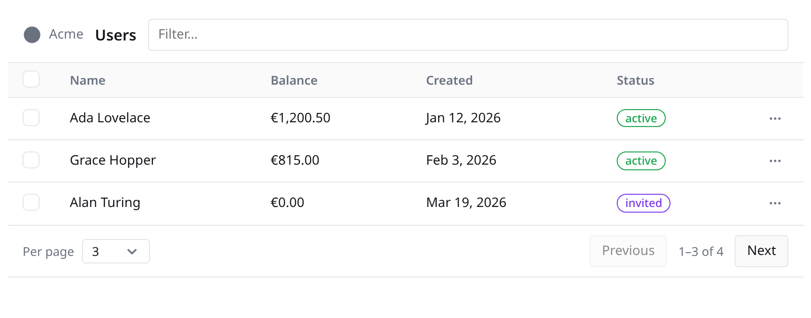
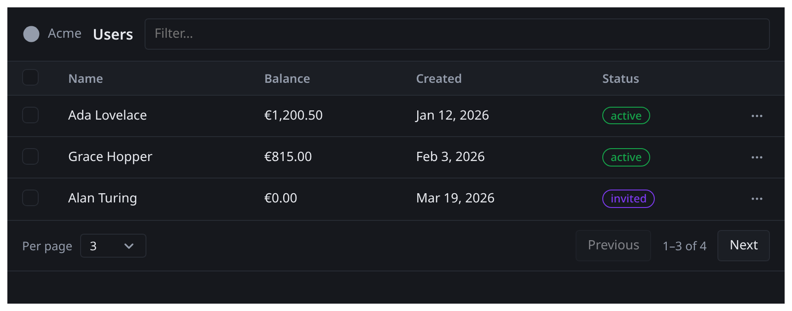
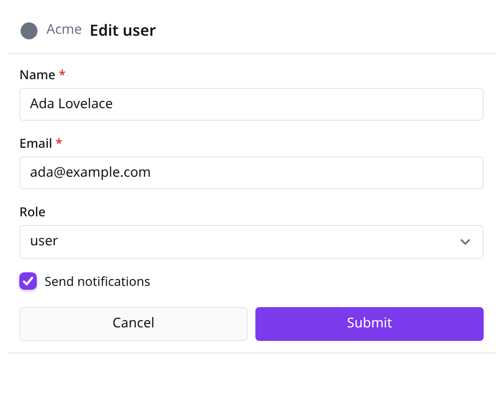
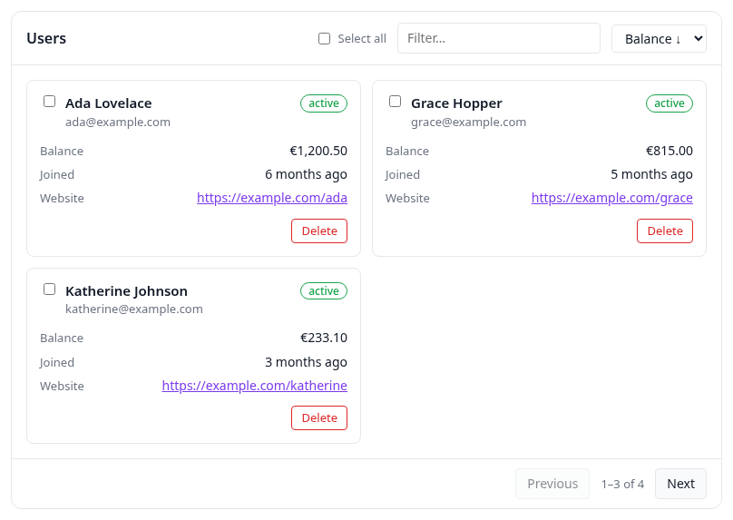
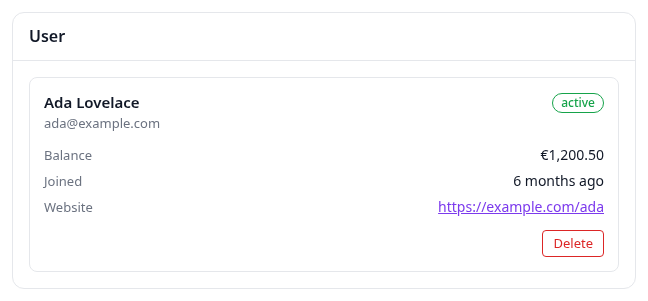

# gadget

Prebuilt, parameterized, interactive HTML widgets for [MCP Apps](https://modelcontextprotocol.io/extensions/apps/overview) — in Go, out of the box.

`gadget` lets an MCP server ship CRUD-style UI — data tables, card grids,
forms — as fully self-contained HTML template resources: inline CSS, inline JavaScript,
zero external files, everything embedded in your single Go binary. Widgets
speak the official MCP Apps extension (`io.modelcontextprotocol/ui`, spec
`2026-01-26`) and render in any compliant host (Claude, ChatGPT, VS Code,
Cursor, Goose, Postman, …).

> **Status: pre-release.** APIs are not stable yet.

<p align="center">
  
</p>

<p align="center">
  
  &nbsp;&nbsp;
  
</p>

<p align="center"><sub>Table and Form widgets rendered by the <code>examples/harness</code> fake host — light and host dark themes.</sub></p>

<p align="center">
  
</p>

<p align="center">
  
</p>

<p align="center"><sub>CardList lays a collection out as a card grid (same filter/sort/pagination/selection as Table); Card renders a single record.</sub></p>

## Quickstart

```go
package main

import (
    "context"
    "net/http"

    "github.com/modelcontextprotocol/go-sdk/mcp"
    "github.com/techthos/gadget"
    "github.com/techthos/gadget/gosdk"
)

func main() {
    table := &gadget.Table{
        URI:   "ui://myapp/users",
        Title: "Users",
        Columns: []gadget.Column{
            gadget.Text("name", "Name"),
            gadget.Number("balance", "Balance", "currency:EUR"),
            gadget.Badge("status", "Status", map[string]gadget.BadgeVariant{
                "active": gadget.BadgeSuccess,
            }),
        },
        Filterable: true,
        PageSize:   10,
    }

    server := mcp.NewServer(&mcp.Implementation{Name: "myapp"}, gosdk.EnableUI(nil))

    type in struct{}
    type out struct {
        Rows []map[string]any `json:"rows"`
    }
    gosdk.AddWidgetToolFor(server, table,
        &mcp.Tool{Name: "list_users", Description: "List users in a table."},
        func(context.Context, *mcp.CallToolRequest, in) (*mcp.CallToolResult, out, error) {
            rows, _ := gadget.RowsOf(loadUsers())
            return nil, out{Rows: rows}, nil
        })

    h := mcp.NewStreamableHTTPHandler(func(*http.Request) *mcp.Server { return server }, nil)
    http.ListenAndServe(":8080", h)
}
```

Ask a connected assistant to "list the users" and it renders an interactive,
host-themed table — sortable, filterable, paginated — inside the chat.

## Features

- **Table**: typed columns (text/number/date/badge/link/actions), client-side
  sort/filter/pagination, row selection with bulk actions, per-row actions →
  MCP tool calls, inline destructive-action confirmation, empty/loading states.
- **Form**: 10 field types, native + inline client validation, submit as a
  tool call, server-side field errors mapped inline, prefill for edit flows.
- **Host-aware theming**: `--gadget-*` design tokens defaulting to
  host-injected CSS variables (Claude/ChatGPT look automatic), `Theme` struct
  overrides, dark mode.
- **Locale-aware**: numbers/dates formatted via `Intl` with the host's
  locale and time zone.
- **SDK-agnostic core** + adapter for the official
  [go-sdk](https://github.com/modelcontextprotocol/go-sdk); the core works
  with any Go MCP implementation.
- **Self-contained by construction**: documents satisfy the spec's default
  locked-down CSP; no CDN, no network, no files on disk.

## Documentation

- [Widget reference](docs/widgets.md) — Table, Form, actions, data contract
- [Theming](docs/theming.md) — tokens, host variables, dark mode
- [Architecture](docs/architecture.md) — rendering model, runtime, security

## Examples

- `examples/demo` — complete MCP server (streamable HTTP or `-stdio`):
  list/edit/save/delete/archive users. Point MCPJam or any MCP Apps host at
  `http://localhost:8080/mcp`.
- `examples/harness` — a fake MCP Apps host in one HTML page: renders
  widgets in a sandboxed iframe, answers the JSON-RPC handshake, logs all
  traffic, simulates tool results/errors and theme changes. `go run
  ./examples/harness`, open `http://localhost:8090`.

## Development

The TypeScript/CSS runtime lives in `ui/` and is bundled with esbuild into
`internal/assets/dist/` (committed, `go:embed`-ed — consumers never need
Node).

```sh
make assets       # npm ci + build the runtime bundle
make test         # go test ./... + vitest
make verify-dist  # fail if committed dist doesn't match ui/ sources
```

Golden-file tests: `go test ./ -update` regenerates `testdata/golden/`.

## License

MIT
